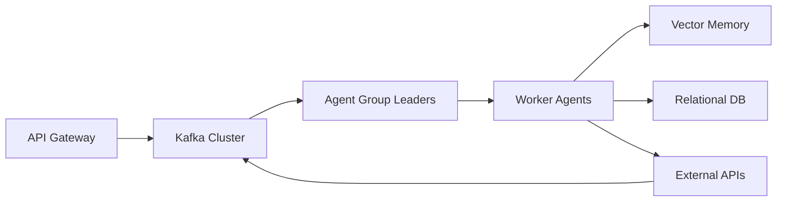

# 🧠 Sales Agentic Army Framework

<div align="center">

[](https://opensource.org/licenses/MIT)
[](https://www.python.org/downloads/)
[](https://github.com/psf/black)
[](https://github.com/sales-agentic-army/sales-agentic-army/actions/workflows/ci.yml)
[](https://www.docker.com/)
[](https://kubernetes.io/)
[](https://sales-agentic-army.readthedocs.io/)

**Production-grade multi-agent orchestration framework for autonomous sales at scale**

*Orchestrate 1000+ specialized AI agents performing lead generation, outreach, negotiation, closing, and analytics with enterprise-grade reliability.*

[Quick Start](#-quick-start) • [Architecture](#-architecture) • [Documentation](https://sales-agentic-army.readthedocs.io/) • [Examples](examples/) • [Contributing](CONTRIBUTING.md)

</div>

---

## 🎯 Overview

The **Sales Agentic Army** is an enterprise-grade framework designed to deploy, manage, and scale thousands of autonomous AI agents for B2B sales automation. Built on cutting-edge technologies including **LangGraph**, **Ray**, **Kafka**, and **Kubernetes**, this system provides:

- **Hierarchical Agent Orchestration**: Multi-level supervisor architecture managing agent swarms
- **Event-Driven Communication**: Real-time pub/sub messaging via Apache Kafka
- **Hybrid Memory Systems**: Vector + relational memory per agent with ChromaDB + PostgreSQL
- **Auto-Scaling Infrastructure**: KEDA-powered horizontal scaling to 10,000+ concurrent agents
- **RL Fine-Tuning**: Ray RLlib integration for continuous improvement of negotiation strategies
- **Enterprise Security**: Zero-trust architecture with mTLS, OAuth2, and HashiCorp Vault integration
- **Full Observability**: Prometheus metrics, Grafana dashboards, and OpenTelemetry tracing

## ✨ Key Features

### 🧩 Agent Specialization (15+ Pre-built Roles)

| Agent Type | Responsibility | Tech Stack |
|------------|---------------|------------|
| **LeadFinder** | Prospecting & enrichment | Clearbit API, LinkedIn scraper, Crunchbase |
| **EmailCrafter** | Personalized outreach generation | LLM prompting, A/B testing framework |
| **SchedulerAgent** | Meeting coordination | Calendly API, timezone management |
| **NegotiatorAgent** | Deal terms optimization | Game theory, RL-based strategy |
| **ClosingSpecialist** | Contract finalization | DocuSign API, legal compliance checks |
| **SentimentAnalyst** | Conversation emotion tracking | Transformer models, real-time scoring |
| **CompetitorTracker** | Market intelligence | Web scraping, news API aggregation |
| **FollowUpManager** | Cadence optimization | Temporal scheduling, priority queuing |
| **CRMSyncAgent** | Bidirectional CRM updates | Salesforce, HubSpot, Pipedrive connectors |
| **ReportGenerator** | Analytics & insights | Pandas, Plotly, automated PDF generation |
| **ComplianceOfficer** | Regulatory adherence | GDPR, CCPA, CAN-SPAM validation |
| **PricingStrategist** | Dynamic pricing models | Econometric modeling, competitor analysis |
| **CustomerSuccessAgent** | Post-sale engagement | NPS tracking, churn prediction |
| **SocialSellerAgent** | LinkedIn/Twitter engagement | Social media APIs, content scheduling |
| **VoiceAssistantAgent** | Phone call automation | Twilio, speech-to-text, real-time coaching |

### 🔁 Event-Driven Architecture



- **Apache Kafka**: High-throughput message bus (1M+ msg/sec)
- **RabbitMQ**: Task queue for synchronous operations
- **Redis**: Distributed caching & session management
- **NATS**: Lightweight service mesh communication

### 🧠 Advanced Memory Systems

- **Short-term**: In-memory conversation context (LangChain memory)
- **Medium-term**: ChromaDB vector embeddings for semantic search
- **Long-term**: PostgreSQL with pgvector for historical learning
- **Shared Knowledge**: Qdrant cluster for cross-agent knowledge transfer

### ⚖️ Auto-Scaling Infrastructure

```yaml
# KEDA ScaledObject Configuration
minReplicas: 10
maxReplicas: 10000
triggers:
  - type: kafka
    metadata:
      topic: agent-tasks
      lagThreshold: '100'
  - type: cpu
    metricType: Utilization
    targetAverageValue: 70
```

- **Horizontal Pod Autoscaler**: CPU/memory-based scaling
- **KEDA**: Event-driven scaling based on Kafka lag
- **Cluster Autoscaler**: Node provisioning on cloud providers
- **Pod Disruption Budgets**: Zero-downtime deployments

### 📈 Reinforcement Learning Integration

- **Ray RLlib**: Distributed RL training for negotiation agents
- **Multi-Armed Bandits**: A/B testing optimization for email subject lines
- **Policy Gradient Methods**: Continuous improvement of conversion strategies
- **Offline RL**: Learning from historical sales call transcripts

### 🛡️ Enterprise Security

- **Authentication**: OAuth2 + JWT with RBAC
- **Secrets Management**: HashiCorp Vault integration
- **Network Security**: Istio service mesh with mTLS
- **Data Encryption**: AES-256 at rest, TLS 1.3 in transit
- **Audit Logging**: Immutable audit trail via blockchain-style hashing
- **Compliance**: SOC2, GDPR, CCPA ready

### 📊 Observability Stack

- **Metrics**: Prometheus + VictoriaMetrics
- **Dashboards**: Grafana with pre-built templates
- **Tracing**: OpenTelemetry + Jaeger
- **Logging**: Loki + Fluentd aggregation
- **Alerting**: Alertmanager with PagerDuty integration

## 🚀 Quick Start

### Prerequisites

```bash
# Required
- Python 3.11+
- Docker 24+
- Kubernetes 1.28+ (kind, minikube, or cloud)
- Redis 7+
- PostgreSQL 15+ with pgvector
- Apache Kafka 3.6+

# Optional (for full deployment)
- Helm 3+
- kubectl
- Ray cluster
```

### Installation

```bash
# Clone repository
git clone https://github.com/sales-agentic-army/sales-agentic-army.git
cd sales-agentic-army

# Create virtual environment
python -m venv .venv && source .venv/bin/activate

# Install dependencies
make setup

# Initialize infrastructure
make init-infra

# Run local development stack
docker-compose up -d

# Start orchestrator
make run-orchestrator

# Launch sample agent swarm
python examples/swarm_launcher.py --agents 100 --scenario demo
```

### Deploy to Kubernetes

```bash
# Build and push Docker image
make docker-build docker-push

# Deploy to Kubernetes
kubectl apply -k k8s/overlays/production

# Scale to 1000 agents
kubectl scale deployment agent-worker --replicas=1000

# Monitor deployment
watch kubectl get pods -n sales-system
```

## 🏗️ Architecture

See detailed architecture documentation in [`docs/architecture/`](docs/architecture/)

### High-Level Component Diagram

```
┌─────────────────────────────────────────────────────────────────┐
│                     API Gateway (FastAPI)                        │
│              /health  /spawn  /task  /metrics                    │
└─────────────────────┬───────────────────────────────────────────┘
                      │
                      ▼
┌─────────────────────────────────────────────────────────────────┐
│                  Orchestrator (LangGraph)                        │
│         Supervisor → Group Leaders → Worker Agents               │
└─────────────────────┬───────────────────────────────────────────┘
                      │
          ┌───────────┼───────────┐
          ▼           ▼           ▼
    ┌──────────┐ ┌──────────┐ ┌──────────┐
    │   Kafka  │ │  Redis   │ │  ChromaDB│
    │  Cluster │ │ Cluster  │ │ Cluster  │
    └──────────┘ └──────────┘ └──────────┘
          │           │           │
          ▼           ▼           ▼
    ┌──────────────────────────────────────────┐
    │         Agent Worker Pool (K8s)          │
    │  [LeadFinder] [EmailCrafter] [Scheduler] │
    │  [Negotiator] [Closer] [Analyst] ...     │
    └──────────────────────────────────────────┘
```

## 📦 Project Structure

```
sales-agentic-army/
├── src/
│   ├── orchestrator/       # Main orchestration engine
│   ├── agents/             # Agent implementations
│   ├── memory/             # Memory systems
│   ├── messaging/          # Kafka/RabbitMQ adapters
│   ├── integrations/       # CRM, email, social APIs
│   ├── rl/                 # RL training pipelines
│   └── utils/              # Shared utilities
├── k8s/                    # Kubernetes manifests
├── docker/                 # Docker configurations
├── configs/                # YAML configurations
├── examples/               # Usage examples
├── tests/                  # Test suites
├── docs/                   # Documentation
└── scripts/                # Automation scripts
```

## 🧪 Testing

```bash
# Run unit tests
pytest tests/unit -v

# Run integration tests
pytest tests/integration -v

# Run load tests (1000 agents)
pytest tests/load -v --workers=1000

# Generate coverage report
make coverage
```

## 📈 Performance Benchmarks

| Metric | Value | Configuration |
|--------|-------|---------------|
| Max Concurrent Agents | 10,000+ | K8s cluster (50 nodes) |
| Task Throughput | 50,000 tasks/sec | Kafka + 1000 workers |
| Message Latency | <10ms p99 | Intra-cluster |
| Memory per Agent | ~50MB idle | Stateless design |
| Cold Start Time | <2 seconds | Pre-warmed pool |
| Conversion Lift (RL) | +23% | After 10K episodes |

## 🤝 Contributing

We welcome contributions! Please see our [Contributing Guide](CONTRIBUTING.md) for details.

### Development Setup

```bash
# Fork and clone
git clone https://github.com/YOUR_USERNAME/sales-agentic-army.git

# Install dev dependencies
make dev-setup

# Run pre-commit hooks
pre-commit install

# Create feature branch
git checkout -b feature/amazing-feature
```

## 📄 License

This project is licensed under the MIT License - see the [LICENSE](LICENSE) file for details.

## 🙏 Acknowledgments

- LangChain team for the excellent agent frameworks
- Ray project for distributed RL capabilities
- Kubernetes community for container orchestration
- Apache Kafka for event streaming excellence

## 📬 Contact

- **Documentation**: https://sales-agentic-army.readthedocs.io/
- **Discord**: [Join our community](https://discord.gg/sales-agentic-army)
- **Twitter**: [@SalesAgenticArmy](https://twitter.com/SalesAgenticArmy)
- **Email**: maintainers@sales-agentic-army.io

---

<div align="center">

**Built with ❤️ by the Sales Agentic Army Team**

[Star this repo](https://github.com/sales-agentic-army/sales-agentic-army/stargazers) • [Watch releases](https://github.com/sales-agentic-army/sales-agentic-army/releases) • [Report issues](https://github.com/sales-agentic-army/sales-agentic-army/issues)

</div>
